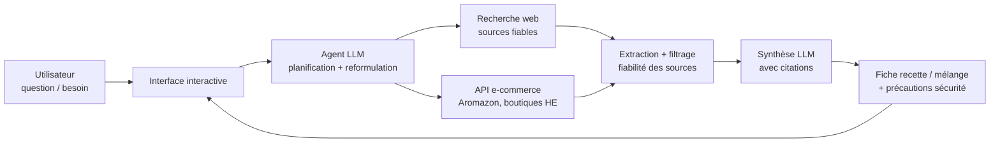
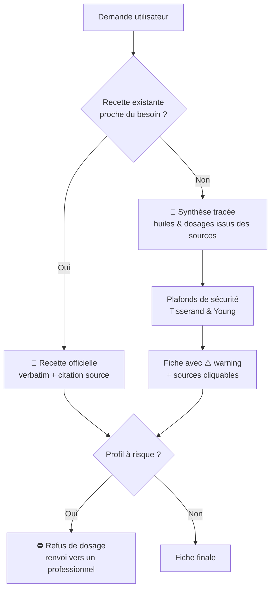

# 🌿 Guide : créer ton agent IA de recherche sur les huiles essentielles

Objectif : un agent qui recherche des **recettes et mélanges d'huiles essentielles** à partir de **sources fiables** (sites de référence, Aromazon et autres boutiques), avec une **interface interactive**.

---

## 1. Architecture recommandée



**Les 4 briques :**
1. **Interface** (chat + filtres) — où l'utilisateur pose sa question et reçoit la fiche.
2. **Cerveau LLM** — reformule la demande, choisit les sources, synthétise.
3. **Connecteurs de recherche** — web search filtré + API produits.
4. **Base de connaissances locale** (optionnel mais puissant) — une base vectorielle contenant tes fiches, recettes validées et monographies.

---

## 2. Choix de la stack

| Besoin | Options recommandées | Pourquoi |
|---|---|---|
| LLM / agent | Mistral API (Agents), OpenAI, Claude | SDK agents natif, fonction calling, coût maîtrisé |
| Recherche web | Tavily, Brave Search API, SerpAPI | Résultats structurés, filtrables par domaine |
| Base vectorielle (RAG) | Chroma, Qdrant, pgvector | Stockage des monographies HE |
| Interface interactive | **Streamlit** ou Gradio (Python) — ou Next.js si tu veux du pro | Déploiement en quelques lignes |
| API produits | Aromazon PA-API, Rainforest API, scraping ethnique de boutiques HE | Prix, avis, disponibilité |
| Orchestration | LangGraph, ou le SDK Agent de ton fournisseur LLM | Gestion des étapes multi-sources |

💡 **Recommandation pragmatique** : Python + Streamlit + API Mistral Agents + Tavily. Tu peux avoir un prototype fonctionnel en une journée.

---

## 3. Sources fiables à câbler en priorité

### 🏛️ Sources scientifiques / institutionnelles
- **ANSM / ANSES** (France) — monographies et mises en garde officielles
- **EMA (Agence européenne du médicament)** — monographies HMPC sur les HE
- **NCCIH (NIH, USA)** — fiches « Herbs at a Glance »
- **PubMed** — pour les études cliniques (via API E-utilities, gratuite)

### 🌱 Sources spécialisées aromathérapie (contenu de qualité)
- **Compagnie des Sens** (compagniedessens.fr) — fiches HE très documentées, chimiotypes, précautions
- **Doctissimo / pages santé** — usage général, à croiser
- **Essentially Canada / Tisserand Institute** — sécurité HE (Robert Tisserand est la référence sécurité)
- **Festival des huiles essentielles / Huiles & Sens** — fiches producteurs sérieux

### 🛒 Sources produits / prix
- **Aromazon** (via PA-API ou Rainforest) — prix, notes, avis
- **Boutiques HE sérieuses** : Aroma-Zone, Comptoir des Huiles, Puressentiel, Aesculape — pour comparer qualité/prix et origine/chimiotype

> ⚠️ Règle d'or : **toujours croiser au moins 2 sources** avant de valider une recette, et **toujours citer l'URL source** dans la réponse.

---

## 4. Fonctionnement de l'agent (pipeline)

1. **Analyse de la demande** : besoin (sommeil, digestion, peau, ambiance…), profil utilisateur (femme enceinte ? enfant ? animal ? — questions **bloquantes pour la sécurité**).
2. **Recherche multi-sources** : la requête est décomposée (ex. « mélange sommeil » → HE lavande + sites de recettes + sécurité lavande).
3. **Filtrage de fiabilité** : liste blanche de domaines ; les autres domaines sont marqués « non vérifié ».
4. **Extraction structurée** : le LLM transforme les pages en JSON normalisé :

```json
{
  "nom_recette": "Mélange diffusion sommeil",
  "huiles": [{"he": "Lavande vraie", "chimiote": "lavandula angustifolia", "gouttes": 3}],
  "base": "100 ml eau + dispersant",
  "usage": "diffusion 30 min avant coucher",
  "sources": ["compagniedessens.fr/...", "tisserandinstitute.org/..."],
  "precautions": ["Déconseillé femmes enceintes 3 premiers mois", "Tenir hors de portée enfants"]
}
```

5. **Synthèse + fiche réponse** : dosages, mode d'emploi, précautions, sources cliquables, et si pertinent, **comparaison produits/prix** Aromazon vs boutiques.

---

## 5. Stratégie de génération des recettes

L'agent ne traite pas toutes les demandes de la même façon : il suit un **ordre de priorité strict**.

### 🥇 Priorité 1 — Recette officielle (verbatim)
Si une recette existante dans les sources (ou la base vectorielle) est **proche du besoin**, elle est réutilisée **telle quelle** — mêmes huiles, mêmes dosages, mêmes précautions. Aucune modification.

- La fiche est estampillée **« ✅ Recette officielle — source : [nom du site] »** avec lien direct.
- Avantages : zéro risque d'erreur inventée, citation parfaite.
- Implémentation : recherche par similarité (base vectorielle) + correspondance des critères (besoin, voie, profil). Seuil de correspondance à définir (ex. ≥ 80 % de critères couverts).

### 🥈 Priorité 2 — Synthèse tracée (avec warning)
Si **aucune recette existante** ne correspond, l'agent **improvise à partir des sources, mais dans un cadre verrouillé** :

- Chaque huile proposée doit apparaître dans **au moins une source récupérée** (jamais de connaissance interne du LLM).
- Chaque goutte est un réajustement d'un dosage **présent dans les sources** (adaptation au volume, à la voie), jamais un dosage inventé.
- Les dilutions max sont **plafonnées par une table codée en dur** (Tisserand & Young) que le LLM ne peut pas dépasser.
- Les contre-indications sont la **réunion** de celles de toutes les sources + la table sécurité.
- La fiche porte un **warning permanent** : **« ⚠️ Mélange synthétisé par l'IA à partir des sources listées — vérifie les dosages avec un professionnel de santé avant utilisation. »**

### 🚫 Interdit absolu
**Aucune improvisation libre** : le LLM ne doit jamais inventer un dosage ex nihilo ni proposer une huile absente des sources. Règle du prompt système : *« Toute huile, goutte ou précaution doit être traçable à une source fournie ; si tu ne peux pas la tracer, tu ne l'inclus pas. »*

### Arbre de décision



---

## 6. Exemple de prompt système

```text
Tu es un assistant expert en aromathérapie. Règles strictes :
1. Tu ne t'appuies QUE sur les résultats de recherche fournis (sources listées).
2. Tu cites chaque affirmation avec son URL source.
3. Pour toute recette, tu affiches TOUJOURS : huiles + chimiotype, nombre de gouttes,
   base de dilution, mode d'administration, contre-indications.
4. Voies sensibles (femme enceinte/allaitante, enfant < 6 ans, épileptique, asthmatique,
   animal) : tu refuses de donner un dosage et tu renvoies vers un professionnel de santé.
5. Si les sources se contredisent, tu le signales explicitement.
6. JAMAIS de conseil d'ingestion sans source médicale officielle (ANSM/EMA/NIH).
7. Langue de réponse : français.
```

---

## 7. Interface interactive

Avec **Streamlit** (le plus rapide) :

```python
import streamlit as st

st.title("🌿 Agent Huiles Essentielles")

besoin = st.text_input("Quel est ton besoin ?", "Trouver un mélange pour mieux dormir")
profil = st.selectbox("Profil", ["Adulte", "Femme enceinte", "Enfant", "Animal"])
voie = st.multiselect("Voie souhaitée", ["Diffusion", "Cutanée", "Bain", "Massage"])

if st.button("Rechercher"):
    # 1. appel agent LLM -> plan de recherche
    # 2. appels Tavily sur sources blanches + Aromazon
    # 3. synthèse LLM -> fiche structurée
    st.session_state["resultat"] = lancer_agent(besoin, profil, voie)

if "resultat" in st.session_state:
    afficher_fiche(st.session_state["resultat"])
```

Fonctionnalités à viser :
- ✅ Chat libre + champs filtres (besoin, profil, voie, budget)
- ✅ Fiches recettes avec badges « ✅ source institutionnelle » / « ⚠️ source blog »
- ✅ Onglet « Produits » avec comparatif prix Aromazon / boutiques
- ✅ Historique et favoris (recettes sauvegardées)
- ✅ Bandeau sécurité permanent

---

## 8. Comparaison produits (Aromazon & co.)

- **Aromazon PA-API** : officiel, nécessite d'être affilié avec ventes. Sinon **Rainforest API** ou **ScraperAPI**.
- Extraire : titre, prix, note, nombre d'avis, mention « chimiotype / botanique » (critère de qualité n°1 d'une HE).
- Afficher une carte par HE : `Nom — origine — chimiote — prix/ml — note — lien`.
- ⚠️ Ne jamais recommander d'ingérer un produit acheté en ligne sans verrou sécurité.

---

## 9. Garde-fous sécurité (non négociables)

| Règle | Implémentation |
|---|---|
| Profils à risque détectés | Mots-clés → l'agent refuse les dosages, renvoie vers un professionnel |
| Pas d'ingestion sans source officielle | Vérification domaine dans les citations |
| Dosages plafonnés | Table de limites max par HE (Tisserand & Young) codée en dur |
| Traces d'audit | Log des sources utilisées pour chaque réponse |

---

## 10. Plan de mise en œuvre

1. **J1** : compte API Mistral + Tavily, script CLI qui répond à une question avec citations.
2. **J2-3** : liste blanche de domaines + extraction JSON des recettes + filtres sécurité.
3. **J4** : interface Streamlit (chat + filtres + fiches).
4. **J5** : connecteur Aromazon (prix/avis) + comparatif produits.
5. **J6+** : base vectorielle de monographies HE, favoris, tests avec un aromathérapeute si possible.

---

*Ce guide est un plan de départ : chaque brique peut être remplacée selon tes moyens et ton niveau technique.*
